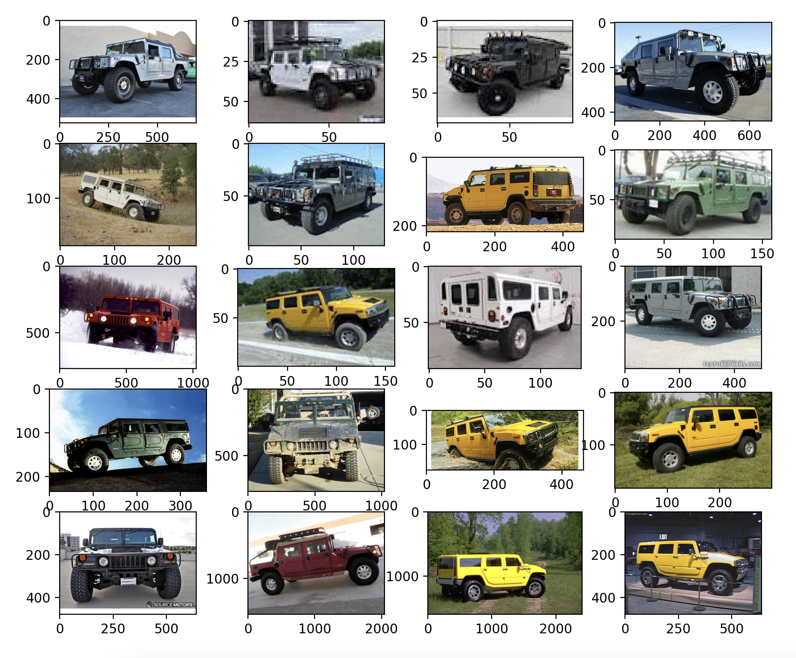
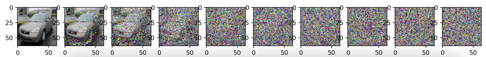
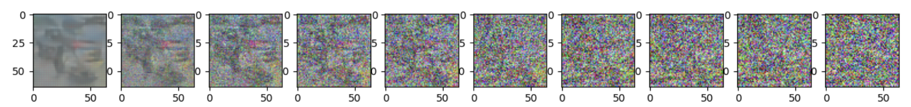

# DDPM Pytorch 实现

这个仓库实现了一个非常简易版的 DDPM (Denoising Diffusion Probabilistic Models)

参考资料：

- 原始论文：[Denoising Diffusion Probabilistic Models](https://arxiv.org/abs/2006.11239)
- YouTube教程：[Diffusion models from scratch in PyTorch](https://www.youtube.com/watch?v=a4Yfz2FxXiY&t=942s)
- Colab Notebook：[A Diffusion Model from Scratch in Pytorch](https://colab.research.google.com/drive/1sjy9odlSSy0RBVgMTgP7s99NXsqglsUL?usp=sharing#scrollTo=bpN_LKYwuLx0)

## 安装相关依赖

```shell
pip install -r requirements.txt
```

## 数据集

数据集采用的是 StandordCars，包含了大约8000张图片在训练集。你可以从 [Kaggle](https://www.kaggle.com/datasets/jessicali9530/stanford-cars-dataset) 下载该数据集，解压文件之后，将文件夹重命名为 `stanford_cars` 放在主目录下，主目录结构应该如下：

```
ddpm(master)
├── README.md
├── stanford_cars
├── requirements.txt
├── sampling.py
└── ...
```

## 展示数据集

展示 StandordCars 数据集里的一些图片。

```shell
python show_dataset.py
```



## 前向扩散

模拟前向扩散，看看效果。

```shell
python forward_noising.py
```



## 构建 U-net 网络

### 核心要点：

- 我们使用了一个简化版的 U-net 去预测噪声。
- 输入是加噪的图片，输出是图片的噪声
- 因为参数在不同的 time step 之间被共享，所以我们需要告诉网络现在是第几步了。
- Time step 使用 Transformer Sinusoidal Embedding 编码。
- 我们只输出一个平均值，因为方差是固定（原论文就是这么设定的）。

若想展示 U-net 的网络结构，我们可以运行：

```shell
python unet.py
```

## 训练模型

开始训练模型，训练完毕后，参数会被保存在 `trained_models` 文件夹下：

```shell
python training_model.py
```

## 生成一张图片

使用训练好的模型生成一张图片，并命名为 `sample.png`。

```shell
python sampling.py
```

